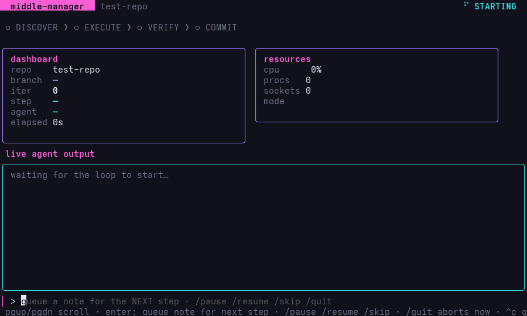

# middle-manager

Micromanaged multi-agent coding loop that orchestrates your favorite coding CLIs.

**Bring your own agents.** middle-manager dynamically chains **Grok**, **Claude Code**, **OpenCode**, **OpenAI Codex**, **Google Antigravity (agy)**, and **Charm Crush** into a tight 4-step software factory. It reads your codebase, scopes out requirements, executes fixes, critiques its own work, runs tests, commits, and opens PRs—completely on autopilot. *(Agents are auto-detected and configured automatically).*

Each agent runs as its own CLI in plain headless mode, so it uses whatever login that tool already has—OAuth session or API key—with **no extra keys or adapters to configure**. And because it's *micromanaged*, you can watch every step live and steer it mid-run.

---

## But Why?

**Get the most out of every model — the ones you pay for and the ones you run for free.** Got a subscription you want to burn down, or a local model sitting idle? Put it on the grunt work in a loop and have a *better* model check it. middle-manager lets you assign a different model to each step and run them in the order that fits your budget and trust:

- A **local or open-source model executes** for free, and a **stronger frontier model verifies** its work.
- A **big, expensive model does only the planning and execution**, while cheaper agents handle the rest.
- Whatever split you want — each step is just a coding CLI pointed at a model, dropped into the **discover → execute → verify → commit** order. The right model in the right seat.

You set it up by configuring each coding agent to use the model you want, then assigning those agents to steps.

**Closing issues is deterministic, not babysat.** Draining a queue, opening PRs, and closing issues runs as fixed, scripted logic — you're not paying an agent to sit and watch a queue. That's faster and cheaper than asking an LLM to mind the lifecycle.

---

## Install (One-Liner)

```bash
curl -fsSL https://raw.githubusercontent.com/bradflaugher/middle-manager/main/install.sh | bash
```

The installer downloads a **prebuilt binary** for your platform from the latest
[GitHub Release](https://github.com/bradflaugher/middle-manager/releases) — **no Go toolchain required**.
If no prebuilt binary is available it falls back to building from source (which
*does* need Go 1.25+). It installs `mm` to `~/.local/bin/mm`.

`mm` shells out to whichever agent CLIs you have installed (`grok`, `claude`,
`opencode`, `codex`, `agy`, `crush`) and to `git`/`gh` — install the ones you want.

<details>
<summary><b>Other ways to install</b></summary>

### Download a binary directly (no Go)
Grab the asset for your OS/arch from the
[Releases page](https://github.com/bradflaugher/middle-manager/releases), then:
```bash
chmod +x mm_linux_amd64 && mv mm_linux_amd64 ~/.local/bin/mm
```

### Build from source (needs Go 1.25+)
Install Go from [go.dev/doc/install](https://go.dev/doc/install), then:
```bash
git clone https://github.com/bradflaugher/middle-manager.git
cd middle-manager
go build -o ~/.local/bin/mm .
```

### Cut a release (maintainers)
Releases (and their prebuilt binaries) are produced by the `Release` GitHub
Action when you push a version tag:
```bash
git tag v0.2.0 && git push origin v0.2.0
```

### PATH
Make sure `~/.local/bin` is on your `PATH`:
```bash
export PATH="$HOME/.local/bin:$PATH"   # add to ~/.bashrc or ~/.zshrc
```
</details>

### Quick Start (Wizard)

To run the interactive wizard and configure your loop step-by-step:
```bash
mm
```


## Advanced CLI Usage (Quick Reference)

| I want to… | Command |
|------------|---------|
| Add a feature | `mm quick "add feature XYZ"` |
| Shorthand feature | `mm "add feature XYZ"` |
| One GitHub issue | `mm --issue 42` |
| All issues by user | `mm --author @someuser --close-issues` |
| All bugs by user | `mm --label bug --author @someuser --close-issues` |
| Good-first-issues sprint | `mm --label "good first issue" --issue-limit 10 --close-issues` |
| Fix the codebase generally | `mm --mode repair` |
| Point at another repo | `mm quick "…" --repo ~/other-project` |
| Pause between steps | `mm quick "…" -i` |

State lives in `<repo>/.middle-manager/`. Issue queue state is per-issue under `.middle-manager/issues/<number>/`.

---

## The Loop

```text
  ┌──────────────┐
  │   DISCOVER   │  Scope requirements & compile guidelines
  └──────────────┘
         │
         ▼
  ┌──────────────┐
  │   EXECUTE    │  Implement the changes
  └──────────────┘
         │
         ▼
  ┌──────────────┐
  │    VERIFY    │  Test & critique
  └──────────────┘
         │
         ├─ (Pass) ─► [ COMMIT ] (PR + Memory)
         │
         └─ (Fail) ─► Loop back & retry
```

middle-manager executes steps in the following order:

1. **Discover**: Scans codebase and active issues, determines the bounds and scope of changes, and writes implementation guidelines.
2. **Execute**: Implements the changes in the target workspace.
3. **Verify**: Reviews the changes, runs tests, and applies critical backpressure on failure.
4. **Commit**: Saves updates, registers context updates in repository memory (`AGENTS.md`), and submits pull requests for review.

A change is only committed on an explicit `VERDICT: PASS` from the verifier — a `FAIL` or a missing/garbled verdict **fails closed** and loops back rather than shipping unverified work. (The verifier agent runs the tests; middle-manager never runs them for you.) The loop also stops itself early if it stalls: if an iteration produces the same diff and the same verifier feedback as the last one, it bails instead of burning iterations.

---

## License

This project is licensed under the [MIT License](LICENSE).

